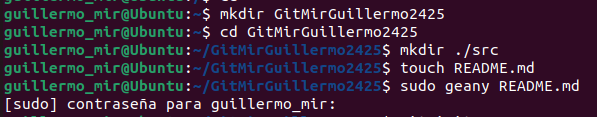
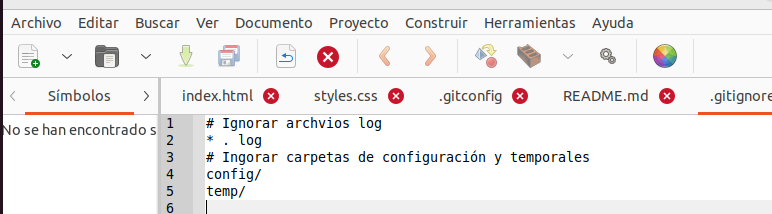
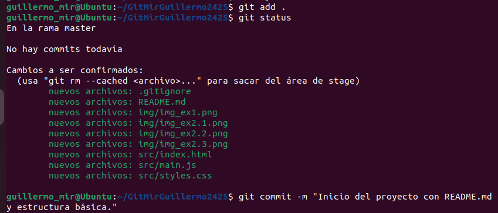
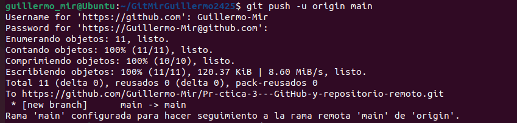
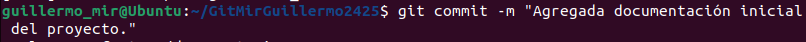
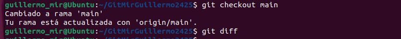
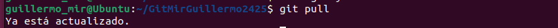
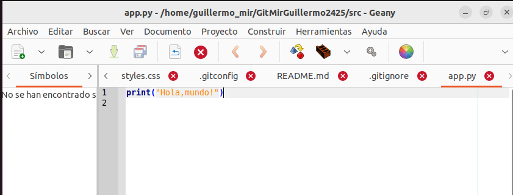
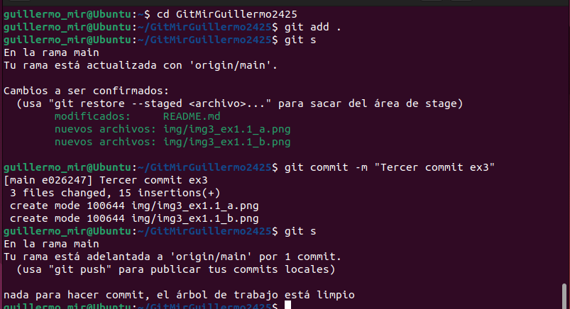
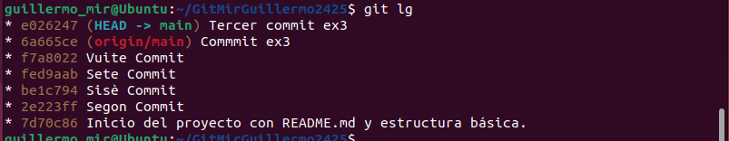

#README Práctica 3 - GitHub y repositorio remoto
##Parte 1: Preparación del Proyecto
##1. Crear directorios y archivos:
-Desde tu carpeta principal (~/), crea un directorio llamado GitApellido1Nombre2425.
-Dentro del directorio GitApellido1Nombre2425, crea una subcarpeta llamada src usando rutas relativas.
-Crea un archivo README.md en GitApellido1Nombre2425 con una breve descripción del proyecto, usa costantemente el terminal.

##2. Inicializa Git:
-Entra en el directorio y conviértelo en un repositorio Git.

-Agrega un archivo .gitignore y configúralo para ignorar archivos de log y carpetas de configuración temporales.

**¿Qué es el archivo .gitignore y para que sirve?** EL archivo .gitignore en un archivo oculto para indicar lo que tiene que indicar el respositorio.
-Crea una estructura básica de web index.html, style.css, main.js.

##3. Primera confirmación:
-Haz un git add de todos los archivos y realiza un commit inicial con el mensaje:
Inicio del proyecto con README.md y estructura básica.

##Parte 2: Colaboración en Equipo
##1.Configura del repositorio remoto:

-Entra en GitHub y crea un repositorio.
**¿Qué pasa si creo un repositorio con el archivo README.md desde GitHub?** AL crear un respositorio con readme deja de ser un repositorio vacio y se muestra unicamente el readme
**¿Qué pasa si crea un repositorio sin el archivo README.md desde GitHub?** Al crear un respositorio sin readme el repositorio se crea vacio, entonces solo se muestra el enlace para poder clonarlo 
-Explica las diferencias entre las 2 preguntas anteriores.
-Indica que comandos te da GitHub al crear un repositorio. Los encontrarás en el apartado …or create a new repository on the command line 
	echo "# Pr-ctica-3---GitHub-y-repositorio-remoto" >> README.md
	git init
	git add README.md
	git commit -m "first commit"
	git branch -M main
	git remote add origin https://github.com/Guillermo-Mir/Pr-ctica-3---GitHub-y-repositorio-remoto.git
	git push -u origin main
-Vincula el repositorio remoto con el repositorio local

##2.Actualización del Proyecto:
-Crea una nueva rama llamada feature/documentacion y cámbiate a ella.

-Cambia a la nueva rama:
-Crea un archivo docs.md en la carpeta raíz. Escribe un resumen de las funcionalidades del proyecto.
-Haz un commit con el mensaje:Agregada documentación inicial del proyecto.

-Cambia a la rama main y usa git diff para comparar las diferencias entre main y feature/documentacion

##3.Sincronización:
Desde la rama main, realiza un git pull para simular la descarga de cambios del remoto. Si hay conflictos, resuélvelos.

##Parte 3: Gestión de Archivos y Cambios
##1.Ediciones rápidas:
-Crea un nuevo archivo llamado src/app.py con un mensaje básico (print("Hola, mundo!")).

-Haz un add y luego un commit. Verifica su estado con  status o con algún comando alias que hayas creado tú.

-Visualiza el historial de commit con log o con algún comando alias que hayas creado tú.

-Si has utilizado comandos alias, indica el equivalente al comando alias. Por ejemplo, mi comando alias git s es igual al comando git status --short.
git status = git s
git log --oneline --decorate --all --graph = git lg
git branch = git br
-Desde main, haz un merge de feature/documentacion.
-Usa log o un alias para verificar los cambios realizados y el historial.

##Parte 4: Entrega del Proyecto
##1.Últimos pasos:

Asegúrate de que todos los archivos estén en su lugar y realiza un push final al remoto.
Realiza una limpieza eliminando la rama feature/documentacion.
##2.Explora el proyecto desde el terminal:

Usa el comando necesario de Linux para listar el contenido de cada directorio.
Muestra el contenido de los archivos finales con el comando necesario de Linux.
