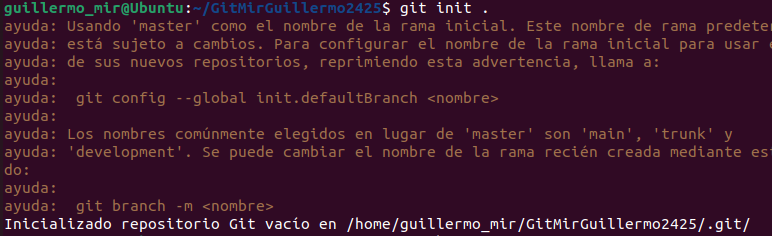

#README Práctica 3 - GitHub y repositorio remoto
##1. Crear directorios y archivos:
-Desde tu carpeta principal (~/), crea un directorio llamado GitApellido1Nombre2425.
-Dentro del directorio GitApellido1Nombre2425, crea una subcarpeta llamada src usando rutas relativas.
-Crea un archivo README.md en GitApellido1Nombre2425 con una breve descripción del proyecto, usa costantemente el terminal.

##2. Inicializa Git:
-Entra en el directorio y conviértelo en un repositorio Git.

-Agrega un archivo .gitignore y configúralo para ignorar archivos de log y carpetas de configuración temporales.

-¿Qué es el archivo .gitignore y para que sirve?
-Crea una estructura básica de web index.html, style.css, main.js.

##3. Primera confirmación:
-Haz un git add de todos los archivos y realiza un commit inicial con el mensaje:
Inicio del proyecto con README.md y estructura básica.

